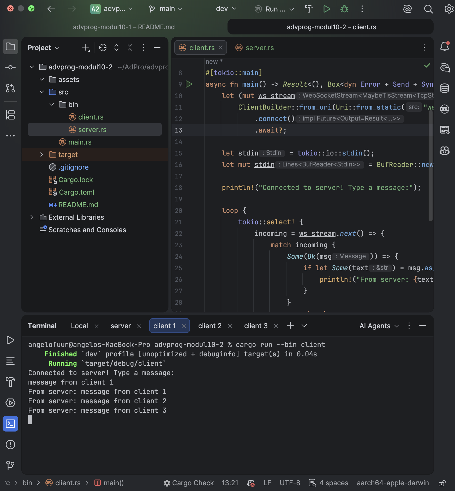
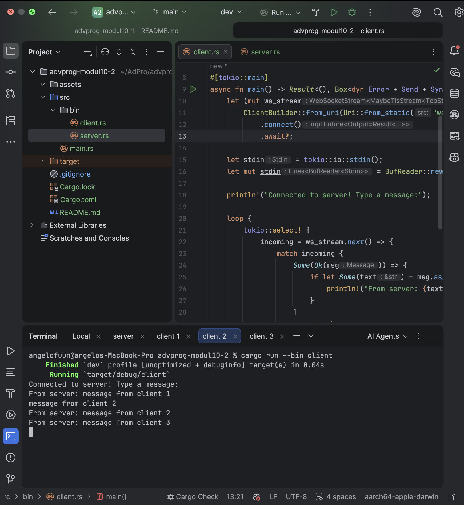
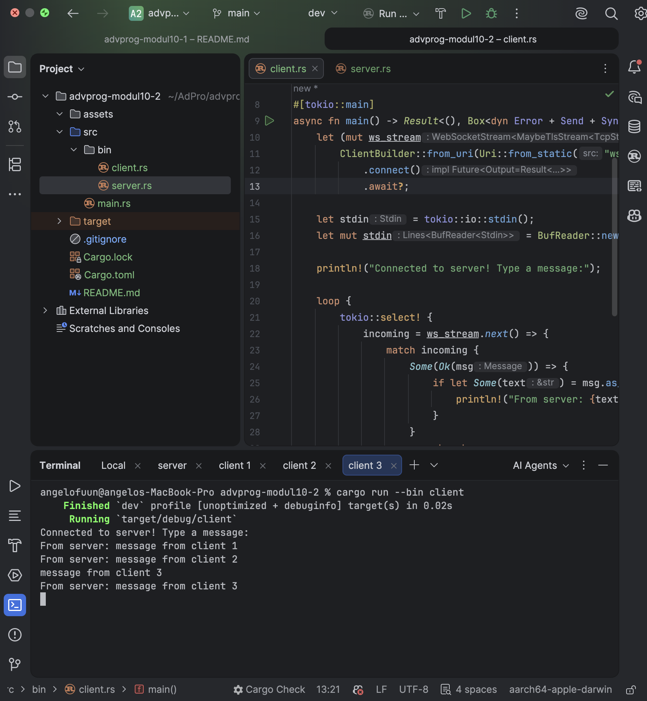
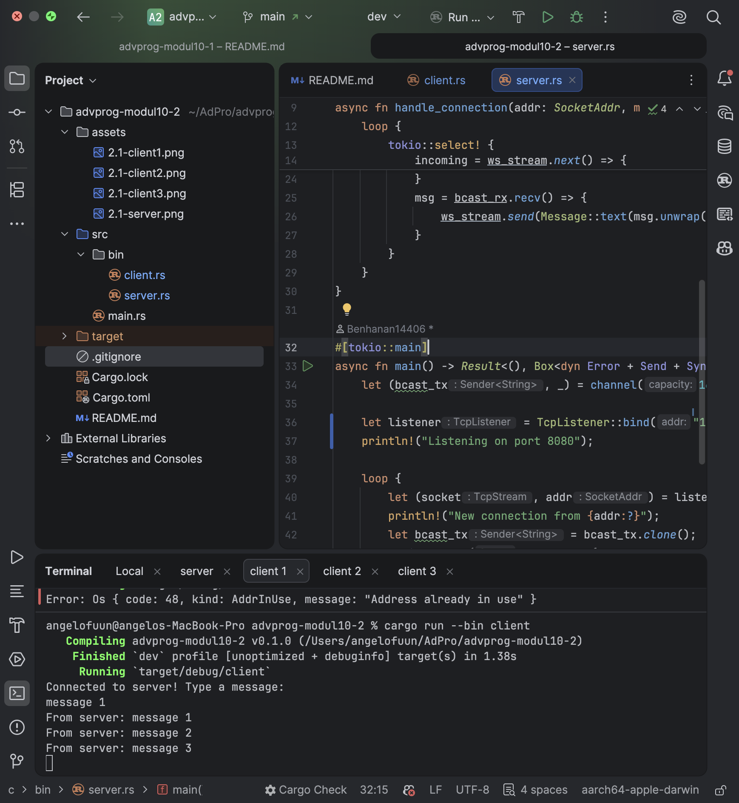
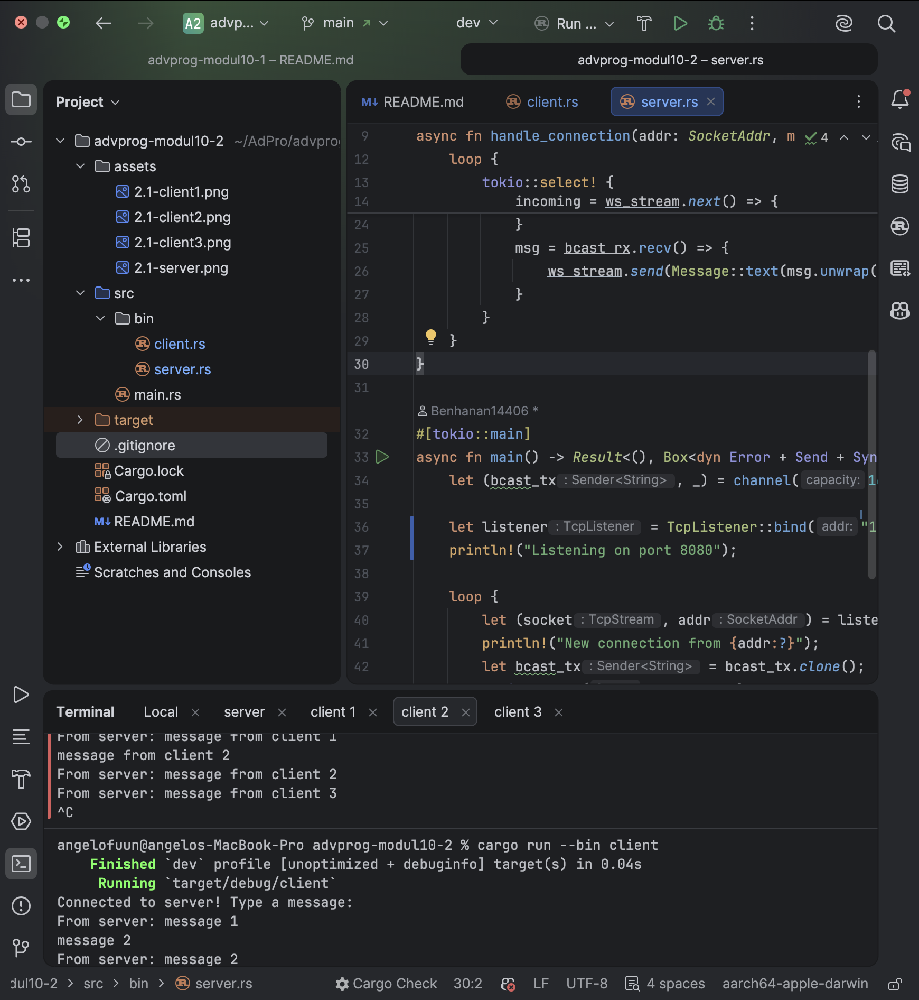
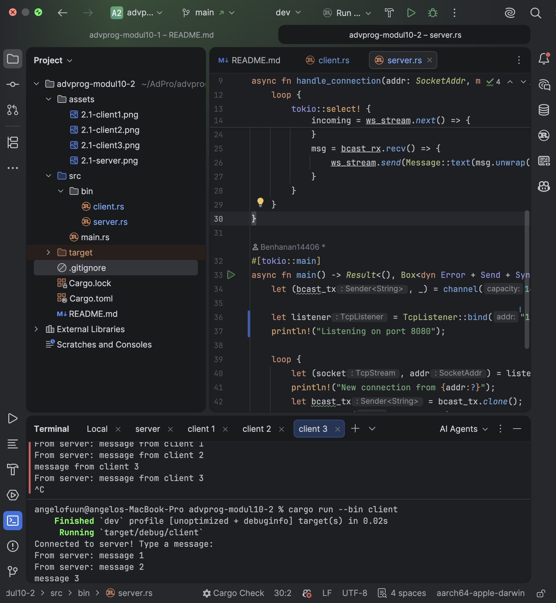
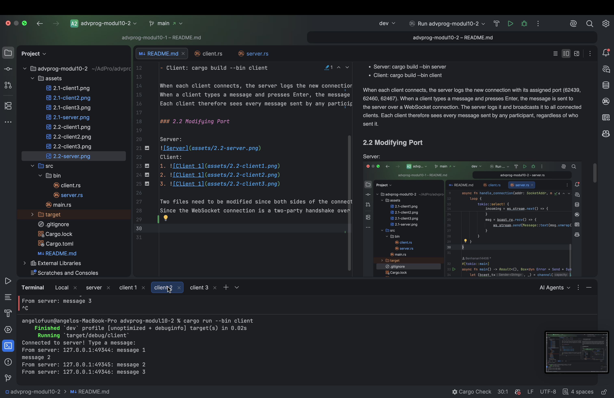
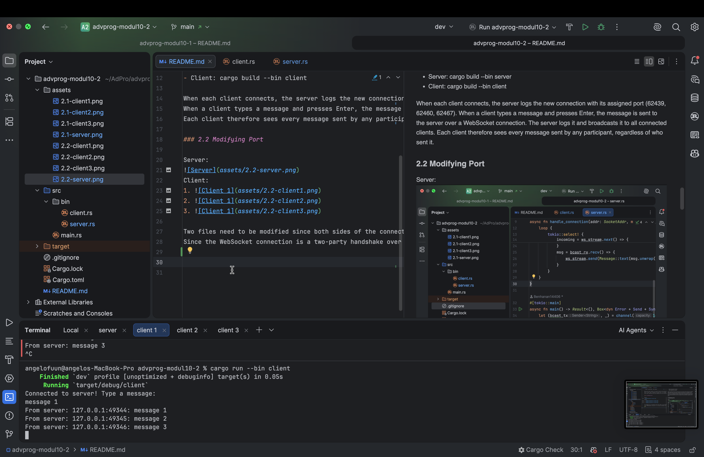
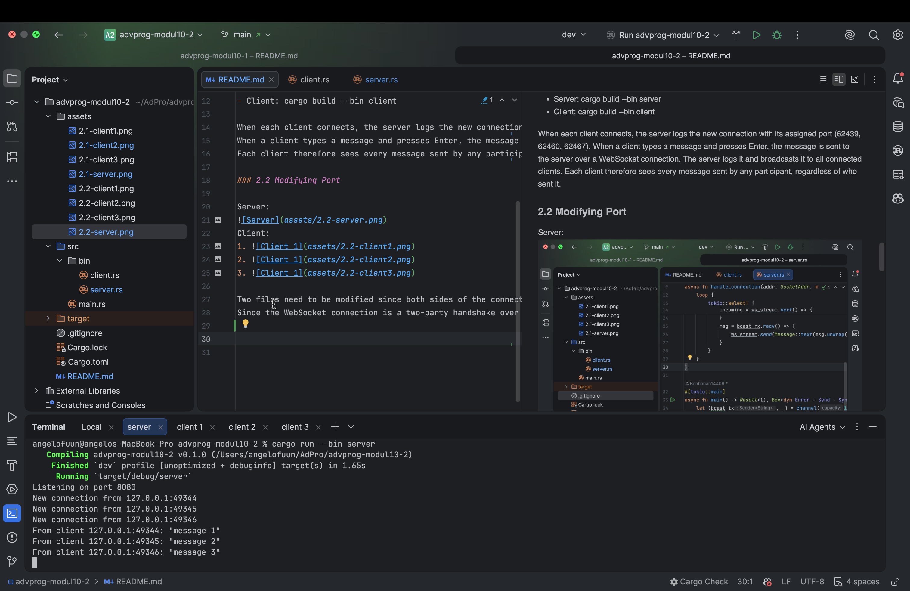
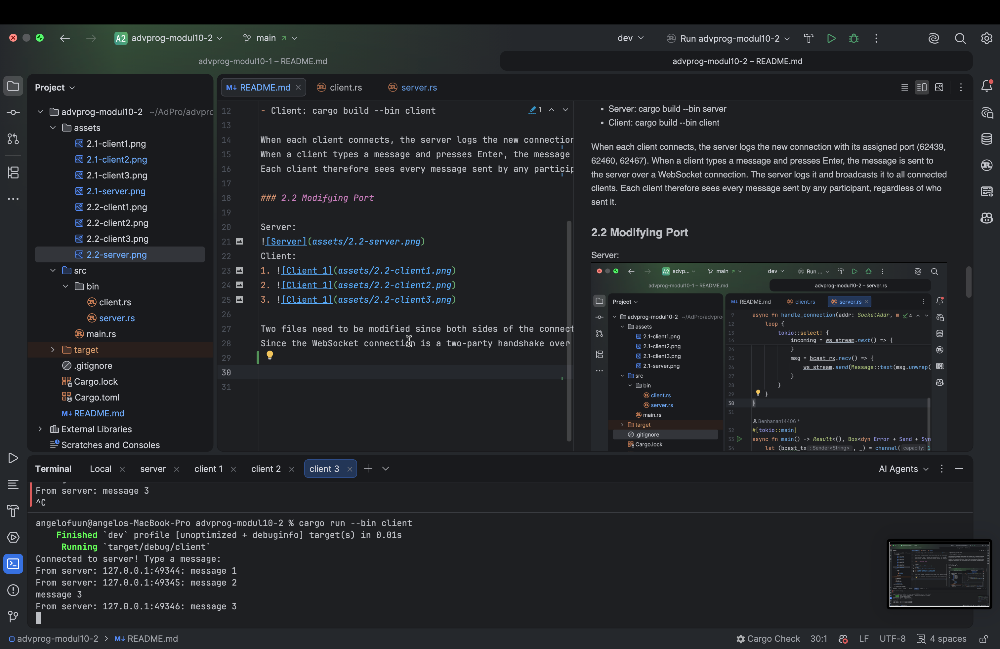

### 2.1 Original Code

Server:

Client:
1. 
2. 
3. 

How to run:
- Server: cargo build --bin server
- Client: cargo build --bin client

When each client connects, the server logs the new connection with its assigned port (62439, 62460, 62467).
When a client types a message and presses Enter, the message is sent to the server over a WebSocket connection. The server logs it and broadcasts it to all connected clients.
Each client therefore sees every message sent by any participant, regardless of who sent it.

### 2.2 Modifying Port

Server:

Client:
1. 
2. 
3. 

Two files need to be modified since both sides of the connection must agree on the same port; server.rs and client.rs.
Since the WebSocket connection is a two-party handshake over TCP where the server binds and listens on a specific port and the client must dial the exact same address, if only one side is updated, the client would attempt to connect to a port nobody is listening on and the connection would be refused.

### 2.3 Small Changes

Server:

Client:
1. 
2. 
3. 

Every client now sees who sent each message.
Each call to handle_connection receives the sender's SocketAddr as a parameter, this is the IP address and port assigned to that specific client's TCP connection. 
Because each client runs in its own Tokio task, each task independently holds its own addr value. 
When a message arrives on that task's WebSocket stream, addr is already in scope, so we simply interpolate it into the broadcast string with format!("{addr}: {text}"). 
The client side needs no modification because it just prints whatever string the server sends.
